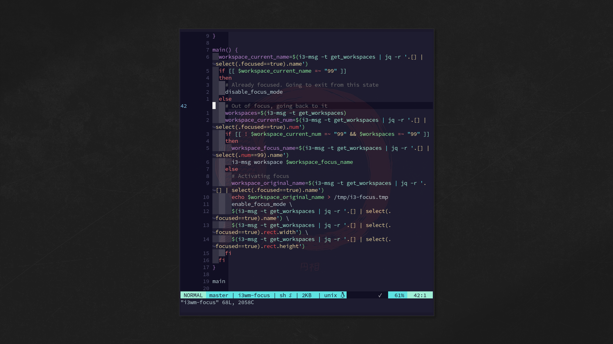

# i3-focus.sh



## i3wm focus mode (sh version)

I recently stumbled upon an [interesting](https://www.reddit.com/r/i3wm/comments/eqzq1d/need_to_focus_try_i3quiet_mode/) [project](https://github.com/vrde/i3-quiet). It is implemented in [Python](https://www.python.org/) and what it does is to offer a distraction free [i3 wm](https://i3wm.org/) experience. Even if not completely new subject, it reads very good!

I was then intrigued and wanted to check if/how I could implement it with plain `sh` script.

Turns out that it is possible (!) and not too difficult (!!): the most time consuming part has been to find why [jq](https://stedolan.github.io/jq) behaved weirdly. Hint: I did not thoroughly `RTFM` (!?!).

Anyway, check the [known issues](#known-issues).

Even if this is a personal project (and it works already well for my needs), since it is publicly hosted I declare it open sourced (with a nice license).

Anyway: suggestions, tips, help, etc are welcome.

### Rational

I had a few constraints in mind. The implementation should:

- be relatively POSIX compliant (`#!/usr/bin/env bash`)
- have [jq](https://stedolan.github.io/jq) as, eventual, only dependency
- need only one [key binding](#i3wm-configuration)

Personally I use `zsh`, but I chose `bash` because `sh` generally is a `depends on os` soft or hard link to some other shell including `bash` itself, `dash`, `pdksh`, etc and a few more reasons.

In this way, the script should behave consistently on every system having `bash` installed.

Also, when leaving focus workspace without exiting focus mode (switching to another workspace/output as usual), the bar should:

- automatically and temporarily be [restored](#polybar-module) as [option](#polybar-configuration)
- automatically be [hidden](#polybar-module) when switching back to focus workspace/output
- automatically and definitely [restored](#polybar-module) when definitely leaving focus mode

About the focused window, it should:

- be restored to the original workspace, even if it does not exist anymore (window was the only one in original workspace)
- be restored to the correct workspace, even if it uses strange/weird names
  - this, hopefully, works

Again, to enter/exit focus mode, to switch from/to focus worksapce should need only one [key binding](#i3wm-configuration).

### i3wm configuration

Only configuration needed on [i3 wm](https://i3wm.org/) side is to add a keybinding in `/path/to/.i3/config`. For example:

```sh
# quiet mode
bindsym $mod+q exec $HOME/dotfiles/bin/i3wm-focus
```
That's all, folks!

Almost all. I do not use borders, if needed, add:

- in `enable_focus_mode()`

```sh
  i3-msg border none
```

- in `disable_focus_mode()`

```sh
  i3-msg border normal
```

### Polybar configuration

#### Polybar IPC

There are two supported way to automatically show/hide the bar depending if focus mode is or not enabled.

The first and more verbose requires a module in Polybar config.

- enable [inter-process messaging](https://github.com/polybar/polybar/wiki/Inter-process-messaging)

```sh
enable-ipc = true
```
in `/path/to/polybar/config` (needed to manage bar state with `polybar-msg cmd show/hide`)

#### Polybar module

```sh
[module/i3-quiet]
type=custom/script
exec=$HOME/dotfiles/bin/i3wm-quiet-polybar
format=<label>
format-background=#282a36
format-foreground=#e6e6e6
label=
tail=true
```
This module can be further stripped down. For example, no need for a visual clue in the bar to work.
With this configuration, the following behavior is offered:

- bar is automatically hidden when entering quiet mode
- switching out of focused workspace without exiting focus mode (switching to another workspace/output as usual):
  - bar is automatically and temporarily [restored](#polybar-module)
  - switching back to focus workspace/output automatically [hides](#polybar-module) again the bar
- bar is automatically restored when definitely exiting focus mode

This method introduces a noticeable lag.

The second, simpler, way:

- solves the lag [known issue](#known-issues)
  - but when switching to another workspace/output as usual, the bar is not automatically and temporarily restored (only restores the bar when exiting focus mode)

I use the second method: much lighter and fast.

A third alternative could be to activate focus mode when launching a specific application, as a PDF viewer.

### Output configuration

At the moment the support is very primitive and, most likely, will remain this way (unless offered `PR` will manage it thoroughly).

To configure it, in `i3wm-quiet`:

- at the end of `enable_focus_mode()`, add one of the following example lines:

```sh
  # Primitive output support
  #i3-msg move container to output "HDMI-1"
  #i3-msg move workspace to output right
```

Adapt them to the personal configuration.

Not sure why, on multiple monitors configuration when moving the focused workspace on different output, when leaving focus mode, the window is correctly restored in the right workspace, but the now empty focus workspace is not automatically closed (see [known issues](#known-issues)).

### Dependencies

[jq](https://stedolan.github.io/jq)

### Known issues

- to manage the bar
  - first method: using [Polybar module](#polybar-module) introduces a noticeable lag
  - second method: to use `polybar-msg cmd toggle` directly in `i3wm-focus` is very quick, but
    - to maintain the script simple, the bar is restored only leaving focus mode

- very primitive outputs support
  - when the [output](#output-configuration) support is enabled and the focus workspace is then moved to another output
    - when leaving focus mode
      - the focus workspace is not automatically closed
        - /shrug

- when exiting focus mode, the window does not automatically goes back to original stack position. To restore an i3 [layout](https://i3wm.org/docs/layout-saving.html) is not straightforward and not a priority for this project (unless a `PR` will do it).

- unable to split the script in proper script file + configuration file:
  - works from terminal
  - completely ignored when using key binding

- a temp file (`/tmp/i3-focus.tmp`) holds the original workspace name

- yes, screenshot taken with scrot...

### Inspiration

[vrde/i3-quiet](https://github.com/vrde/i3-quiet)

### TODO

- some ideas, but this is still an experiment
- to be ble to split the script in proper script file + configuration file would be a nice thing
